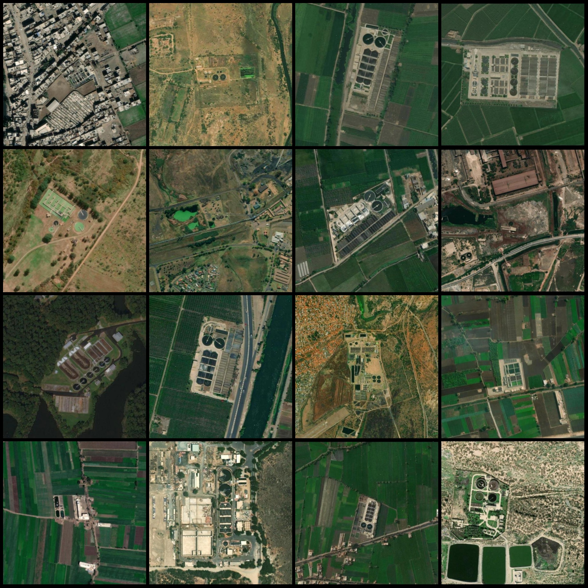
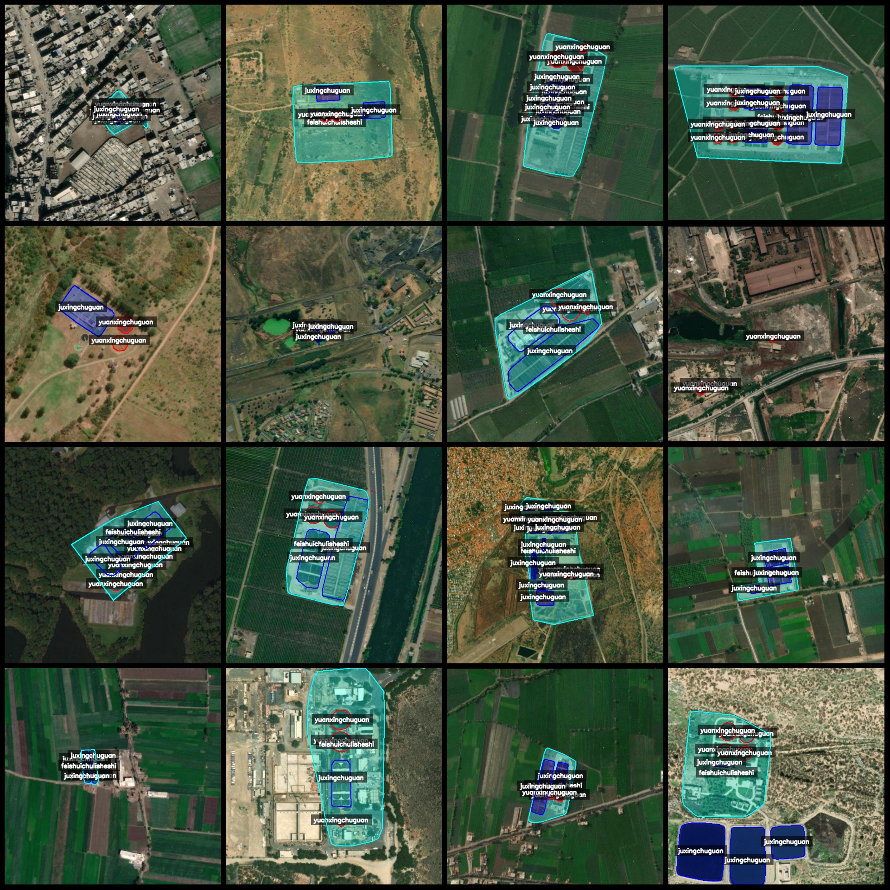
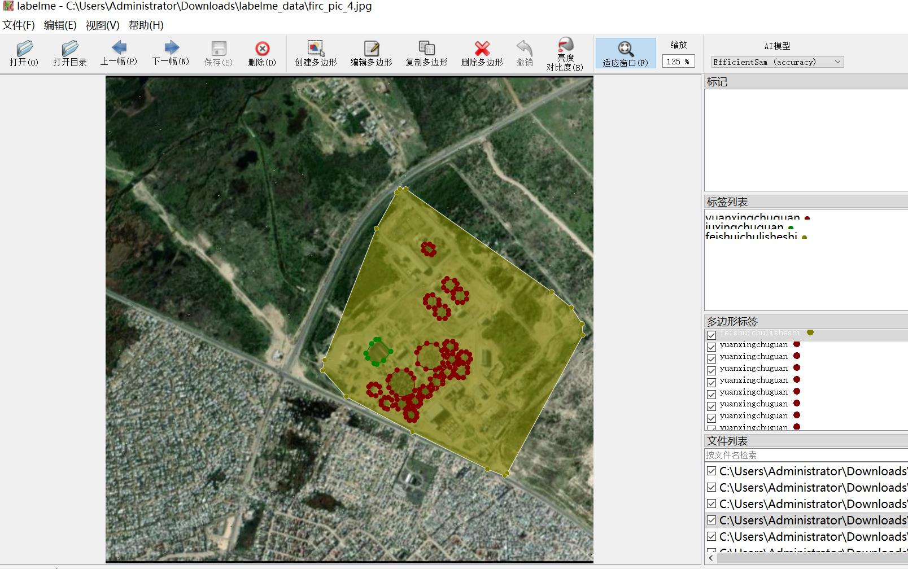

# Remote Sensing Image Sewage Treatment Facilities Identification and Segmentation Dataset in Labelme Format with 1878 Images in 3 Categories

The dataset format is as follows: labelme format (excluding mask files, only containing JPG images and corresponding JSON files).

Number of images (number of JPG files): 1878
Number of annotations (number of JSON files): 1878
Number of categories: 3
Annotation categories: ["feishuichulisheshi", "juxingchuguan", "yuanxingchuguan"]
Corresponding Chinese category names: ["Wastewater Treatment Facility", "Rectangular Tank", "Circular Tank"]
Number of frames per category:
feishuichulisheshi count = 1480
juxingchuguan count = 6976
yuanxingchuguan count = 9816
Total frame count: 18272
Annotation tool used: labelme=5.5.0
Image resolution: 640x640
Annotation rules: Polygons are drawn to mark each category.
Important note: The dataset can be opened and edited using the labelme tool. JSON datasets require conversion to either mask or yolo format or coco format for semantic segmentation or instance 
segmentation.
Special declaration: This dataset does not guarantee the accuracy of the trained models or weight files.
Image preview:
Annotation example:
Original images (randomly selected 16 images):
Annotation drawing results:

## Images

Here is a pay link on Stripe ( https://buy.stripe.com/3cs8yP7sY87d0vu9AB ). Please contact me lonlonago@foxmail.com after funding $89, and I will send you a complete data files , thank you!

